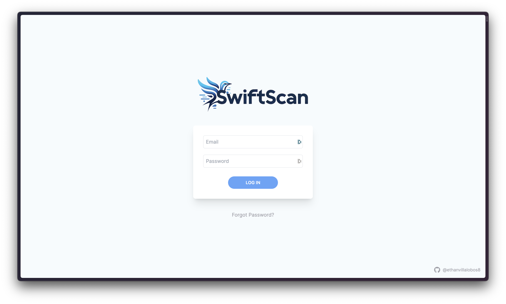
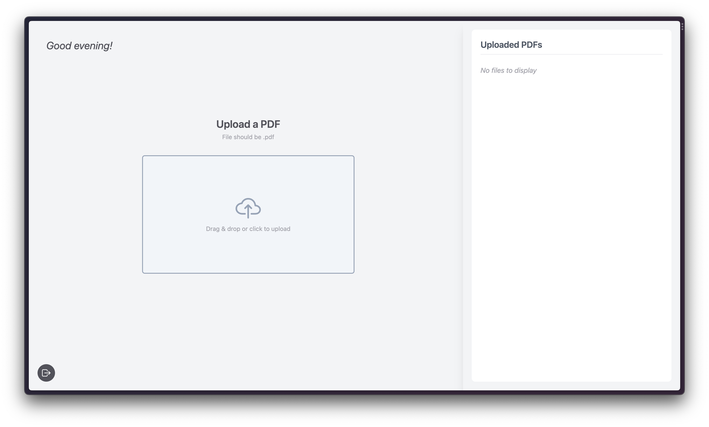
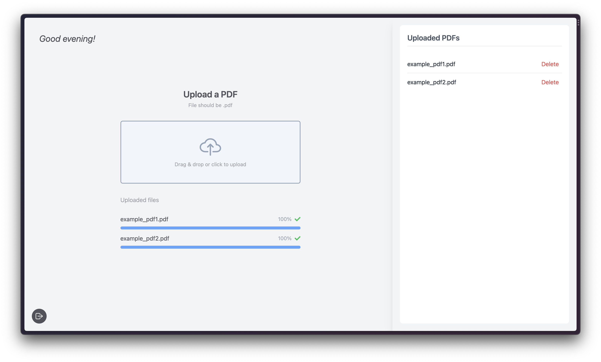

# BBW Assets - Manager Portal

BBW Assets is a simple, supplementary web portal designed to support SwiftScan, a barcode scanner app for inventory management at Bath & Body Works. This portal allows managers to efficiently handle documents and resources. SwiftScan pulls PDFs uploaded to this portal for real-time use, providing seamless integration between the web portal and the main app. Built with a sleek interface, the portal integrates modern web technologies to offer a seamless user experience.

## Features

- **Real-time Integration with SwiftScan:** SwiftScan accesses PDFs uploaded on this portal in real-time.
- **Document Handling:** Easily upload and delete PDF documents.
- **Secure Access:** Protected portal access to ensure only authorized personnel can view and modify documents.

## User Interface





## Getting Started

### Prerequisites

- Node.js
- Firebase Account

### Installation

1. Clone the repository:

    ```bash
    git clone https://github.com/your-username/bbw-asset-manager.git
    ```

2. Navigate to the project directory:

    ```bash
    cd bbw-asset-manager/bbw-asset-portal
    ```

3. Install the dependencies:

    ```bash
    npm install
    ```

4. Create a .env file in the root directory and configure your Firebase settings:

    ```
    FIREBASE_API_KEY=YOUR_API_KEY
    FIREBASE_AUTH_DOMAIN=YOUR_AUTH_DOMAIN
    FIREBASE_PROJECT_ID=YOUR_PROJECT_ID
    FIREBASE_STORAGE_BUCKET=YOUR_STORAGE_BUCKET
    FIREBASE_MESSAGING_SENDER_ID=YOUR_MESSAGING_SENDER_ID
    FIREBASE_APP_ID=YOUR_APP_ID
    NEXT_PUBLIC_FIREBASE_MEASUREMENT_ID=YOUR_MEASUREMENT_ID
    ```

5. Start the development server:

    ```bash
    npm run dev
    ```

## Usage

1. **Login:** Access the portal using your credentials.
2. **Upload:** Drag and drop or select PDF files to upload.
3. **View Uploaded Files:** Check the sidebar to view and manage all uploaded files.

## Built With

- Next.js
- Firebase
- Tailwind CSS
- React Icons

## Contributing

Pull requests are welcome. For major changes, please open an issue first to discuss what you would like to change.

## License

This project is licensed under the MIT License.
